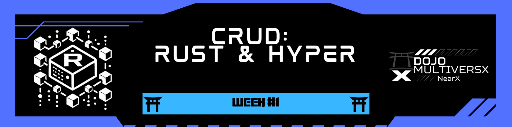

<div align="left">
  <a href="../../README.md">
    
  </a>
</div>


[](challenge1.md)
[](challenge1-en.md)

[← README](../../README.md)

# 🎯 **Desafio #1: Instalação do Rust & Primeiras Impressões**  


---

## 📢 **Objetivo**  
Complete as seguintes tarefas e compartilhe sua experiência! 🚀  

### 🔍 **Tarefas**  

1️⃣ **Instalar o Rust** 🦀  
   - Certifique-se de que o Rust esteja corretamente instalado no seu sistema.  
   - Verifique executando `rustc --version` no terminal.  

2️⃣ **Instalar o xPortal (Wallet)** 💳  
   - Configure a carteira **xPortal** para explorar a funcionalidade blockchain.  

3️⃣ **Postagem nas Redes Sociais** 📝  
   - Publique um post no **LinkedIn** ou **Twitter/X** compartilhando suas impressões sobre a live.  
   - Inclua o que você aprendeu e como foi sua experiência! 🎉 

##### 📢 **Postagens Realizadas:**  

- **[Luciano - Postagem no LinkedIn](https://www.linkedin.com/posts/lucenfort_ia-e-blockchain-v%C3%A3o-transformar-tudo-multiversx-activity-7294824804518359040-n1ts?utm_source=share&utm_medium=member_desktop&rcm=ACoAAElTUVMBgVSjIpZeL4ccPeYlJBCsVaw44hU)**  
- **[Emanoel - Postagem no LinkedIn](https://www.linkedin.com/posts/emanoel-oliveira-br_dojostellar-nearx-stellar-activity-7295447426939678722-EIPC?utm_source=share&utm_medium=member_desktop&rcm=ACoAAElTUVMBgVSjIpZeL4ccPeYlJBCsVaw44hU)**  

---

## ⏱ **Marcos (Milestones)**  

### 📅 **Marco 1: Configuração do Rust**  
- [x] Instalar o Rust  
- [x] Verificar a instalação com `rustc --version`  

### 📅 **Marco 2: Configuração da Carteira xPortal**  
- [x] Baixar e instalar a carteira **xPortal**  
- [x] Confirmar a configuração da carteira  

### 📅 **Marco 3: Postagem nas Redes Sociais**  
- [x] Escrever um post sobre sua primeira experiência  
- [x] Publicar no **LinkedIn** ou **Twitter/X**  

## 📎 **Recursos Úteis**  

🔗 [Guia Oficial de Instalação do Rust](https://www.rust-lang.org/tools/install)  
🔗 [Download da Carteira xPortal](https://www.xportal.com)  

### 📖 **Guia de Instalação: Rust e xPortal Wallet para Desenvolvimento MULTIVERSX**  

<p align="justify">
🛠️ Confira o guia completo no Medium: </p>

<p align="center">
  <a href="https://medium.com/@pavusa/how-to-install-rust-and-xportal-wallet-for-multiversx-development-e3bec1fae898" target="_blank">
    <strong>👉 How to Install Rust and xPortal Wallet for MULTIVERSX Development</strong>
  </a>
</p>

<p align="center">
  <a href="https://medium.com/@pavusa/how-to-install-rust-and-xportal-wallet-for-multiversx-development-e3bec1fae898" target="_blank">
    
  </a>
</p>

---

# 🎯 **Desafio #2: Criando um CRUD com Hyper**  


### 📢 **Objetivo**  
Criar um CRUD simples utilizando **Hyper** para gerenciar registros, como pessoas e livros.  
O objeto precisa ter **dois tipos de dados diferentes** (ex: nome e idade de uma pessoa).  

## 🚀 **Nossa Solução**: CRUD Hyper  

🔗 Disponível em: [CRUD Hyper - Crates.io](https://crates.io/crates/crud_hyper)  

CRUD Hyper é uma aplicação web CRUD (Create, Read, Update, Delete) desenvolvida em **Rust** utilizando a biblioteca **Hyper**. Este projeto demonstra como implementar operações CRUD básicas com um banco de dados em memória e serve como um recurso de aprendizado para desenvolvimento web em Rust.  

### 🌟 **Funcionalidades**  

✅ **Criar** ➜ Adicionar novos itens ao banco de dados.  
✅ **Ler** ➜ Recuperar todos os itens armazenados.  
✅ **Atualizar** ➜ Modificar um item existente.  
✅ **Deletar** ➜ Remover um item do banco de dados.  
✅ **Armazenamento em Memória** ➜ Utiliza `Arc<Mutex<HashMap>>` para segurança de threads.  
✅ **Assíncrono** ➜ Construído com **Tokio** e **Hyper** para alta performance.  

### 🛠 **Requisitos**  

Antes de instalar o projeto, certifique-se de ter:  

- **Rust 1.60+** instalado ([Instalar Rust](https://www.rust-lang.org/))  
- **Cargo**, o gerenciador de pacotes do Rust  

### 📦 **Instalação e Uso**  

Clone o repositório e compile o projeto:  

```sh
git clone https://github.com/yourusername/crud_hyper.git
cd crud_hyper
cargo build
```

Para rodar o servidor localmente:  

```sh
cargo run
```

O servidor iniciará na porta **3000** por padrão.  

### 📡 **API Endpoints**  

#### 🔹 Criar um novo item  

**`POST /items`**  
- **Entrada:**  
  ```json
  { "name": "Alice", "age": 25 }
  ```  
- **Saída:** JSON com ID do novo item  

#### 🔹 Obter todos os itens  

**`GET /items`**  
- **Saída:** JSON com a lista de itens cadastrados  

#### 🔹 Atualizar um item  

**`PUT /items/{id}`**  
- **Entrada:**  
  ```json
  { "name": "Carlos", "age": 30 }
  ```  
- **Saída:** Item atualizado  

#### 🔹 Deletar um item  

**`DELETE /items/{id}`**  
- **Saída:** Confirmação de exclusão  

---

### 👥 **Equipe MetaStakers**  

<div align="center">
  <table>
    <tr>
      <td align="center">
        <a href="https://github.com/robdicoco">
          <br>
          <sub><b>Rob DC</b></sub>
        </a>
      </td>
      <td align="center">
        <a href="https://github.com/alfatektecnologia">
          <br>
          <sub><b>Emanoel</b></sub>
        </a>
      </td>
      <td align="center">
        <a href="https://github.com/lucenfort">
          <br>
          <sub><b>Luciano</b></sub>
        </a>
      </td>
    </tr>
  </table>
</div>

---

### 📖 **Como criar sua primeira API CRUD com Hyper em Rust**  

<p align="justify">
🛠️ Confira o guia completo no Medium: </p>

<p align="center">
  <a href="https://medium.com/@pavusa/build-your-first-crud-api-with-hyper-in-rust-a-step-by-step-guide-e327af658b79" target="_blank">
    <strong>👉 Build Your First CRUD API with Hyper in Rust: A Step-by-Step Guide</strong>
  </a>
</p>

<p align="center">
  <a href="https://medium.com/@pavusa/build-your-first-crud-api-with-hyper-in-rust-a-step-by-step-guide-e327af658b79" target="_blank">
    
  </a>
</p>


## 📜 **Licença**  

Este projeto está licenciado sob a **MIT License**. Consulte o arquivo [LICENSE](LICENSE) para mais detalhes.  

---

<p align="center"> 🚀 Desenvolvido durante o programa <strong>Dojo MultiversX ❎</strong></p>
