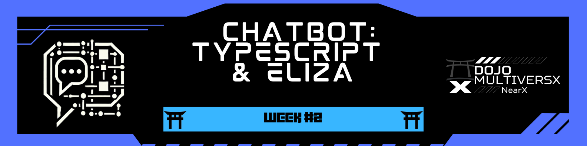

  

[← README](../../README-en.md)

# 🎯 **Challenge #2: AI with TypeScript - Chatbot using GPT**  

---

## 📢 **Objective**  
Develop a simple chatbot using GPT and TypeScript! 🚀  

### 🔍 **Tasks**  

1️⃣ **Develop a Chatbot with GPT Integration** 🤖  
   - Create a TypeScript application that uses the GPT API.
   - Implement a chat system with a user interface or accessible API.

2️⃣ **Integrate with Stellar Blockchain** 🌐  
   - Save data on the Stellar Testnet.
   - Adjust the API to retrieve data stored on Stellar.
   - Integrate the obtained data into a web interface.

3️⃣ **Document the Project** 📝  
   - Create clear documentation about the implementation and features.
   - Share learnings and challenges encountered during development.

---

## ⏱ **Milestones**  

### 📅 **Milestone 1: Project Setup**  
- [x] Configure TypeScript environment
- [x] Set up access to AI APIs (GPT, Gemini, or alternatives)
- [x] Structure the project with best practices

### 📅 **Milestone 2: Chatbot Development**  
- [x] Implement integration with the chosen AI API
- [x] Create endpoints for interacting with the chatbot
- [x] Test and refine chatbot responses

### 📅 **Milestone 3: Stellar Integration**  
- [x] Configure access to the Stellar Testnet
- [x] Implement functionalities to store data on the blockchain
- [x] Create endpoints to retrieve data from the blockchain

### 📅 **Milestone 4: Interface and Finalization**  
- [x] Integrate data obtained from the blockchain into the interface
- [x] Optimize user experience
- [x] Finalize documentation and prepare demonstration

## 📎 **Useful Resources**  

🔗 [Ollama - Step by Step Guide](https://github.com/SkkJodhpur/Gen-ai/blob/main/Models/Ollama_3_A_Step_by_Step_Guide/Ollama_3_A_Step_by_Step_Guide.ipynb)  
🔗 [Google AI Studio - API Keys](https://aistudio.google.com/apikey)  
🔗 [Groq - AI-focused cloud](https://groq.com/)  
🔗 [Ollama - Local AI models](https://ollama.com/)  
🔗 [OpenAI Tokenizer](https://platform.openai.com/tokenizer)  
🔗 [ELIZA Framework](https://github.com/elizaOS/eliza/tree/main)  
🔗 [Alfred ELIZA Starter with EVM plugin](https://github.com/kamikazebr/alfred-eliza-starter)  

---

# 🚀 **Our Solution**: AI Chatbot with Stellar Integration

We developed an intelligent chatbot using TypeScript and integration with the OpenAI GPT API. The chatbot not only answers user questions but is also capable of storing and retrieving data from the Stellar blockchain, creating a decentralized persistence system for interactions.

### 🌟 **Features**  

✅ **Natural Language Processing** ➜ Uses the OpenAI API to understand and respond to natural language queries.  
✅ **Blockchain Storage** ➜ Saves conversation histories and relevant data on the Stellar network.
✅ **Data Retrieval** ➜ Accesses information previously stored on the blockchain.
✅ **RESTful API** ➜ Intuitive endpoints for interacting with the chatbot and stored data.
✅ **Integrated Web Interface** ➜ Data visualization and chatbot interaction in a user-friendly interface.

### 🛠 **Technologies Used**  

- **TypeScript** for robust and typed backend development
- **Express.js** for creating the REST API
- **OpenAI API** for natural language processing
- **Stellar SDK** for interaction with the Stellar blockchain
- **Axios** for HTTP requests

### 📖 **How We Implemented the Solution**  

Our solution was developed in stages, starting with setting up the TypeScript environment and integrating with the OpenAI API. Next, we implemented the connection to the Stellar network to store conversation data and other relevant information. Finally, we created an API that allows not only interaction with the chatbot but also retrieval and visualization of data stored on the blockchain.

The integration with Stellar provides a decentralized persistence layer, ensuring that data is stored securely and transparently. This also allows for the creation of an immutable history of interactions, which can be useful for future analysis or auditing.

### 👥 **MetaStakers Team**  

  <table>
    <tr>
      <td align="center">
        <a href="https://github.com/robdicoco">
           
          <b>Rob DC</b>
        </a>
      </td>
      <td align="center">
        <a href="https://github.com/alfatektecnologia">
           
          <b>Emanoel</b>
        </a>
      </td>
      <td align="center">
        <a href="https://github.com/lucenfort">
           
          <b>Luciano</b>
        </a>
      </td>
    </tr>
  </table>

  

---

## 📜 **License**  

This project is licensed under the **MIT License**. See the [LICENSE](LICENSE) file for more details.  

---

 🚀 Developed during the <strong>Dojo MultiversX ❎</strong> program
