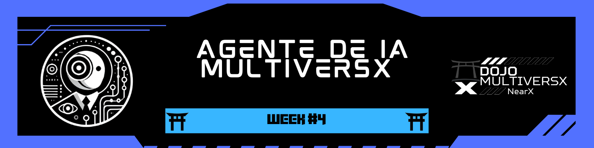

  

[← README](../../README-en.md)

# 🎯 **Challenge #4: The Agent that Interacts with MultiversX**  

---

## 📢 **Objective**  
Develop an AI agent that interacts with the MultiversX ecosystem, seeking to solve real community problems! 🚀  

### 🔍 **Tasks**  

1️⃣ **Create a Personalized AI Agent** 🤖  
   - Develop an agent using Prompt Engineering.
   - Define the agent's personality, style, and characteristics.
   - Implement an action system (Langchain Tools).

2️⃣ **Integration with MultiversX** 🌐 
   - Develop resources that solve problems or add value to the MultiversX ecosystem.
   - Implement blockchain integrations.
   - Create useful features for platform users.

3️⃣ **Document the Process** 📝 
   - Explain the structure and functionalities of the agent.
   - Document the integrations performed.
   - Share learnings and challenges encountered during development.

---

## ⏱ **Milestones**  

### 📅 **Milestone 1: Agent Planning and Design**  
- [x] Define the agent's purpose and functionalities
- [x] Create the personality and response style
- [x] Plan the integrations with MultiversX

### 📅 **Milestone 2: Agent Development**  
- [x] Implement the prompt engineering system
- [x] Develop the agent's actions (tools)
- [x] Test basic communication and responses

### 📅 **Milestone 3: MultiversX Integration**  
- [x] Implement connection with the MultiversX blockchain
- [x] Develop specific functionalities for the ecosystem
- [x] Test and refine integrations

### 📅 **Milestone 4: Finalization and Documentation**  
- [x] Optimize the user experience
- [x] Complete comprehensive documentation
- [x] Prepare functional demonstration

## 📎 **Useful Resources**  

🔗 [ELIZA Framework](https://github.com/elizaOS/eliza)  
🔗 [MultiversX Agent Kit](https://github.com/multiversx/mx-agent-kit)  
🔗 [MultiversX Plugin for ELIZA](https://github.com/elizaos-plugins/plugin-multiversx)  
🔗 [ELIZA Character Generator](https://elizagen.howieduhzit.best/)  
🔗 [MultiversX AI Megawave](https://multiversx.com/ai-megawave)  

---

# 🚀 **Our Solution**: AI Chatbot with Local Model

We developed an intelligent chatbot that runs locally using the Ollama model, allowing users to have their own AI assistant without depending on paid external services or usage restrictions. Our solution offers greater privacy, lower latency, and total control over the AI model.

## 🌟 **Key Features**

✅ **Local Execution** ➜ Uses Ollama to run AI models directly on the user's machine.  
✅ **User-Friendly Web Interface** ➜ Interactive chat with simple and intuitive HTML/CSS interface.  
✅ **Real-Time Response** ➜ Response streaming for a more natural experience.  
✅ **Low Latency** ➜ Quick responses by not depending on external APIs.  
✅ **Guaranteed Privacy** ➜ Data never leaves the user's local environment.

## 🛠 **Technologies Used**

- **TypeScript/Node.js** for backend server development
- **Express.js** for creating the REST API
- **Ollama** for local execution of AI models (deepseek-r1:1.5b)
- **HTML/CSS/JavaScript** for interactive user interface
- **node-fetch** for communication with the Ollama server

## 📖 **How We Implemented the Solution**  

Our approach was to democratize access to AI, allowing anyone to have their own chatbot running locally on their machine, without the need for token payments or concerns about usage limits. To achieve this, we developed a Node.js server that communicates with Ollama, a lightweight framework that allows AI models to run locally.

The server acts as an intermediary between the web interface and the AI model, sending user messages for processing and receiving model responses in real-time. We use streaming to display responses as they are generated, providing a more natural and responsive experience.

The web interface was developed in a simple and intuitive way, allowing users to easily interact with the chatbot. The system is light enough to run on personal computers, making AI accessible even for users with limited computational resources.

## 📝 **Detailed Article**

We documented our journey and implementation in a detailed article on Medium:

  <a href="https://medium.com/@pavusa/create-your-own-ai-chatbot-in-minutes-a-step-by-step-guide-to-building-and-running-your-personal-980635a5bff9" target="_blank">
    <strong>👉 Create Your Own AI Chatbot in Minutes: A Step-by-Step Guide to Building and Running Your Personal AI Model</strong>
  </a>

  

## 💻 **Source Code**

The complete code is available at:

[GitHub - Local AI Chatbot](https://github.com/robdicoco/dojo-multiversx/tree/main/src/chatbot)

## 👥 **MetaStakers Team**  

  <table>
    <tr>
      <td align="center">
        <a href="https://github.com/robdicoco">
           
          <b>Rob DC</b>
        </a>
      </td>
      <td align="center">
        <a href="https://github.com/alfatektecnologia">
           
          <b>Emanoel</b>
        </a>
      </td>
      <td align="center">
        <a href="https://github.com/lucenfort">
           
          <b>Luciano</b>
        </a>
      </td>
    </tr>
  </table>

---

## 📜 **License**  

This project is licensed under the **MIT License**. See the [LICENSE](LICENSE) file for more details.  

---

 🚀 Developed during the <strong>Dojo MultiversX ❎</strong> program
 