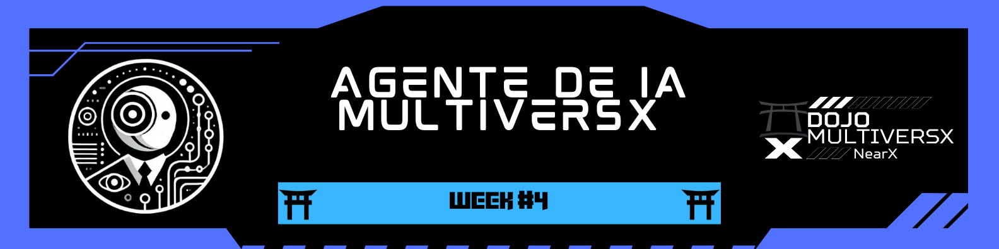

  

[← README](../../README.md)

# 🎯 **Desafio #4: A Agente que Interage com a MultiversX**  

---

## 📢 **Objetivo**  
Desenvolver um agente de IA que interage com o ecossistema MultiversX, buscando resolver problemas reais da comunidade! 🚀  

### 🔍 **Tarefas**  

1️⃣ **Criar um Agente de IA Personalizado** 🤖  
   - Desenvolver um agente usando Prompt Engineering.
   - Definir personalidade, estilo e características do agente.
   - Implementar um sistema de ações (Langchain Tools).

2️⃣ **Integração com MultiversX** 🌐  
   - Desenvolver recursos que resolvam problemas ou agreguem valor ao ecossistema MultiversX.
   - Implementar integrações com a blockchain.
   - Criar funcionalidades úteis para os usuários da plataforma.

3️⃣ **Documentar o Processo** 📝  
   - Explicar a estrutura e funcionalidades do agente.
   - Documentar as integrações realizadas.
   - Compartilhar aprendizados e desafios encontrados durante o desenvolvimento.

---

## ⏱ **Marcos (Milestones)**  

### 📅 **Marco 1: Planejamento e Design do Agente**  
- [x] Definir o propósito e funcionalidades do agente
- [x] Criar a personalidade e estilo de resposta
- [x] Planejar as integrações com MultiversX

### 📅 **Marco 2: Desenvolvimento do Agente**  
- [x] Implementar o sistema de prompt engineering
- [x] Desenvolver as ações (tools) do agente
- [x] Testar a comunicação e respostas básicas

### 📅 **Marco 3: Integração com MultiversX**  
- [x] Implementar conexão com a blockchain MultiversX
- [x] Desenvolver funcionalidades específicas para o ecossistema
- [x] Testar e refinar as integrações

### 📅 **Marco 4: Finalização e Documentação**  
- [x] Otimizar a experiência do usuário
- [x] Finalizar documentação completa
- [x] Preparar demonstração funcional

## 📎 **Recursos Úteis**  

🔗 [ELIZA Framework](https://github.com/elizaOS/eliza)  
🔗 [MultiversX Agent Kit](https://github.com/multiversx/mx-agent-kit)  
🔗 [Plugin MultiversX para ELIZA](https://github.com/elizaos-plugins/plugin-multiversx)  
🔗 [Gerador de Personagens ELIZA](https://elizagen.howieduhzit.best/)  
🔗 [MultiversX AI Megawave](https://multiversx.com/ai-megawave)  

---

# 🚀 **Nossa Solução**: Chatbot IA com Modelo Local

Desenvolvemos um chatbot inteligente que executa localmente utilizando o modelo Ollama, permitindo que usuários tenham seu próprio assistente de IA sem depender de serviços externos pagos ou com restrições de uso. Nossa solução oferece maior privacidade, menor latência e total controle sobre o modelo de IA.

## 🌟 **Principais Características**

✅ **Execução Local** ➜ Utiliza o Ollama para rodar modelos de IA diretamente na máquina do usuário.  
✅ **Interface Web Amigável** ➜ Chat interativo com interface HTML/CSS simples e intuitiva.  
✅ **Resposta em Tempo Real** ➜ Streaming de respostas para uma experiência mais natural.  
✅ **Baixa Latência** ➜ Respostas rápidas por não depender de APIs externas.  
✅ **Privacidade Garantida** ➜ Os dados não saem do ambiente local do usuário.

## 🛠 **Tecnologias Utilizadas**

- **TypeScript/Node.js** para o desenvolvimento do servidor backend
- **Express.js** para criação da API REST
- **Ollama** para execução local de modelos de IA (deepseek-r1:1.5b)
- **HTML/CSS/JavaScript** para interface de usuário interativa
- **node-fetch** para comunicação com o servidor Ollama

## 📖 **Como implementamos a solução**  

Nossa abordagem foi democratizar o acesso à IA, permitindo que qualquer pessoa possa ter seu próprio chatbot rodando localmente em sua máquina, sem necessidade de pagamentos por tokens ou preocupações com limites de uso. Para isso, desenvolvemos um servidor Node.js que se comunica com o Ollama, um framework leve que permite executar modelos de IA localmente.

O servidor atua como intermediário entre a interface web e o modelo de IA, enviando as mensagens do usuário para processamento e recebendo as respostas do modelo em tempo real. Utilizamos streaming para exibir as respostas à medida que são geradas, proporcionando uma experiência mais natural e responsiva.

A interface web foi desenvolvida de forma simples e intuitiva, permitindo que os usuários interajam facilmente com o chatbot. O sistema é leve o suficiente para rodar em computadores pessoais, tornando a IA acessível mesmo para usuários com recursos computacionais limitados.

## 📝 **Artigo Detalhado**

Documentamos nossa jornada e implementação em um artigo detalhado no Medium:

  <a href="https://medium.com/@pavusa/create-your-own-ai-chatbot-in-minutes-a-step-by-step-guide-to-building-and-running-your-personal-980635a5bff9" target="_blank">
    <strong>👉 Create Your Own AI Chatbot in Minutes: A Step-by-Step Guide to Building and Running Your Personal AI Model</strong>
  </a>

  

## 💻 **Código Fonte**

O código completo está disponível em:

[GitHub - Chatbot IA Local](https://github.com/robdicoco/dojo-multiversx/tree/main/src/chatbot)

## 👥 **Equipe MetaStakers**  

  <table>
    <tr>
      <td align="center">
        <a href="https://github.com/robdicoco">
           
          <b>Rob DC</b>
        </a>
      </td>
      <td align="center">
        <a href="https://github.com/alfatektecnologia">
           
          <b>Emanoel</b>
        </a>
      </td>
      <td align="center">
        <a href="https://github.com/lucenfort">
           
          <b>Luciano</b>
        </a>
      </td>
    </tr>
  </table>

---

## 📜 **Licença**  

Este projeto está licenciado sob a **MIT License**. Consulte o arquivo [LICENSE](LICENSE) para mais detalhes.  

---

 🚀 Desenvolvido durante o programa <strong>Dojo MultiversX ❎</strong>
 