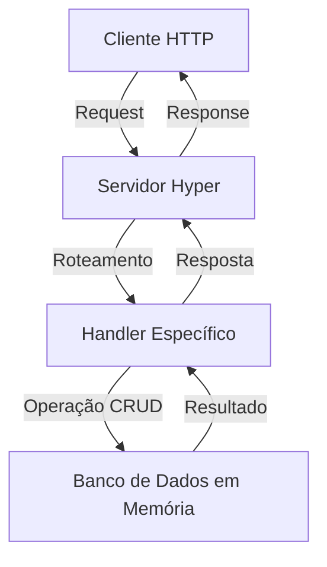

<div align="center">
  <!-- Nota: Para uma visualização completa, crie a imagem "crud_hyper_banner.png" na pasta img/ -->
  <h1>🚀 CRUD Hyper</h1>

  [](https://www.rust-lang.org/)
  [](https://crates.io/crates/crud_hyper)
  [](LICENSE)
  [](https://nearx.com.br/)
</div>

<p align="center">
  Uma aplicação web CRUD (Create, Read, Update, Delete) construída com a biblioteca <code>hyper</code> do Rust. Este projeto demonstra como implementar operações CRUD básicas com um banco de dados em memória e serve como um recurso de aprendizado para desenvolvimento web em Rust.
</p>

<!-- Nota: Consulte o arquivo img/README_IMAGES.txt para informações sobre as imagens recomendadas para este README -->

---

## Índice
- [Índice](#índice)
- [Funcionalidades](#funcionalidades)
- [Instalação](#instalação)
  - [Pré-requisitos](#pré-requisitos)
  - [Via Cargo](#via-cargo)
  - [Clonando o repositório](#clonando-o-repositório)
- [Uso](#uso)
  - [Como biblioteca](#como-biblioteca)
  - [Como servidor standalone](#como-servidor-standalone)
- [Exemplos de Uso](#exemplos-de-uso)
  - [Criando um item](#criando-um-item)
  - [Listando todos os itens](#listando-todos-os-itens)
  - [Atualizando um item](#atualizando-um-item)
  - [Removendo um item](#removendo-um-item)
- [Testes](#testes)
- [Arquitetura](#arquitetura)
- [Fluxo de Dados](#fluxo-de-dados)
- [Roadmap](#roadmap)
- [Equipe](#equipe)
- [Licença](#licença)

---

## Funcionalidades

<div align="center">
  <table>
    <tr>
      <td align="center"><b>✨ Create</b></td>
      <td>Adicione novos itens ao banco de dados com IDs e nomes personalizados.</td>
    </tr>
    <tr>
      <td align="center"><b>🔍 Read</b></td>
      <td>Recupere todos os itens armazenados no banco de dados em formato JSON.</td>
    </tr>
    <tr>
      <td align="center"><b>🔄 Update</b></td>
      <td>Modifique o nome de um item existente através de seu ID único.</td>
    </tr>
    <tr>
      <td align="center"><b>🗑️ Delete</b></td>
      <td>Remova itens do banco de dados utilizando seu ID.</td>
    </tr>
    <tr>
      <td align="center"><b>🧵 Thread-Safe</b></td>
      <td>Armazenamento em memória usando <code>Arc&lt;Mutex&lt;HashMap&gt;&gt;</code> para segurança entre threads.</td>
    </tr>
    <tr>
      <td align="center"><b>⚡ Assíncrono</b></td>
      <td>Utiliza <code>tokio</code> e <code>hyper</code> para processamento assíncrono de alta performance.</td>
    </tr>
  </table>
</div>

---

## Instalação

### Pré-requisitos

- Rust 1.60 ou superior
- Cargo (gerenciador de pacotes do Rust)

### Via Cargo

O modo mais simples de adicionar o CRUD Hyper ao seu projeto é através do Cargo:

```bash
cargo add crud_hyper
```

### Clonando o repositório

Para desenvolvimento ou execução do servidor:

```bash
# Clone o repositório
git clone https://github.com/robdicoco/dojo-multiversx

# Navegue até o diretório do projeto
cd dojo-multiversx/src/crud_hyper

# Compile o projeto
cargo build --release

# Execute o servidor
cargo run
```

O servidor iniciará na porta 3000 por padrão.

---

## Uso

### Como biblioteca

```rust
use crud_hyper::{create_item, read_items, update_item, delete_item};
use crud_hyper::{Item, Db};
use std::sync::{Arc, Mutex};
use std::collections::HashMap;

// Inicialize o banco de dados
let db: Db = Arc::new(Mutex::new(HashMap::new()));

// Crie um item
let item = Item {
    id: 1,
    name: String::from("Exemplo de Item"),
};
create_item(&db, item).unwrap();

// Leia todos os itens
let items = read_items(&db);
println!("Itens no banco de dados: {:?}", items);

// Atualize um item
update_item(&db, 1, String::from("Item Atualizado")).unwrap();

// Delete um item
delete_item(&db, 1).unwrap();
```

### Como servidor standalone

Execute o servidor e utilize ferramentas como `curl`, Postman ou qualquer cliente HTTP para interagir com a API:

```bash
cargo run
```
---

## Exemplos de Uso

### Criando um item

```bash
curl -X POST http://localhost:3000/items \
  -H "Content-Type: application/json" \
  -d '{"id": 1, "name": "Primeiro Item"}'
```

### Listando todos os itens

```bash
curl -X GET http://localhost:3000/items
```

### Atualizando um item

```bash
curl -X PUT http://localhost:3000/items/1 \
  -H "Content-Type: application/json" \
  -d '"Item Atualizado"'
```

### Removendo um item

```bash
curl -X DELETE http://localhost:3000/items/1
```

---

## Testes

O projeto inclui testes unitários para garantir o funcionamento correto das operações CRUD:

```bash
# Execute todos os testes
cargo test

# Execute apenas os testes da funcionalidade de criação
cargo test test_create_item

# Execute todos os testes com output detalhado
cargo test -- --nocapture
```

---

## Arquitetura

O projeto segue uma arquitetura modular que separa as responsabilidades em diferentes componentes:

- **data.rs**: Define a estrutura de dados `Item` e implementa as operações CRUD fundamentais.
- **manage_item.rs**: Implementa handlers HTTP para cada operação CRUD.
- **server_hyper.rs**: Configura o servidor HTTP e roteia as requisições para os handlers adequados.
- **main.rs**: Inicializa o servidor e configura a aplicação.

---

## Fluxo de Dados



---

## Roadmap

- [x] Persistência de dados em arquivos ou banco de dados
- [x] Autenticação e autorização
- [x] Validação de entradas mais robusta
- [x] Paginação para endpoints de listagem
- [x] Suporte a filtros e ordenação
- [x] Documentação da API com Swagger/OpenAPI

---

## Equipe

Este projeto foi desenvolvido pela equipe **MetaStakers** como parte do programa **Dojo MultiversX**:

<div align="center">
  <table>
    <tr>
      <td align="center">
        <a href="https://github.com/robdicoco">
          <br>
          <sub><b>Rob DC</b></sub>
        </a>
      </td>
      <td align="center">
        <a href="https://github.com/alfatektecnologia">
          <br>
          <sub><b>Emanoel</b></sub>
        </a>
      </td>
      <td align="center">
        <a href="https://github.com/lucenfort">
          <br>
          <sub><b>Luciano</b></sub>
        </a>
      </td>
    </tr>
  </table>
</div>

<p align="center">
  
</p>

---

## Licença

Este projeto está licenciado sob a **Licença MIT**. Consulte o arquivo [LICENSE](LICENSE) para obter mais detalhes.

---

<p align="center">🌟 Desenvolvido durante o programa <strong>Dojo MultiversX</strong> por <strong>MetaStakers</strong></p>

